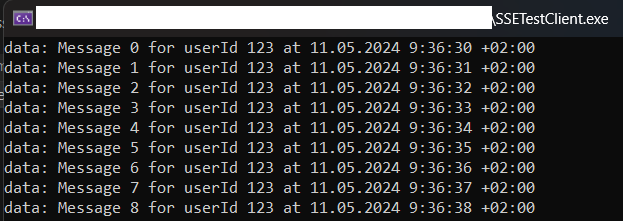

# ServerSideEvents example
This project demonstrates a minimal implementation of SSE server based on asp.net

The server provides an HTTP GET endpoint "/events/for/{userId}" with the header "text/event-stream". 
Once a connection is established to this endpoint, messages begin to be transmitted with a specified delay.


The project also contains console application with simplified implementation of an SSE client that returns data via IAsyncEnumerable

```C#
using Microsoft.Extensions.DependencyInjection;

using SSETestClient.Logic;

var serviceCollection = new ServiceCollection();
serviceCollection.AddSingleton<ISseClient, SseClient>();
serviceCollection.AddSingleton(new HttpClient());

var sp = serviceCollection.BuildServiceProvider();

using var scope = sp.CreateScope();
var service = scope.ServiceProvider.GetRequiredService<ISseClient>();

using var cts = new CancellationTokenSource();
Console.CancelKeyPress += (sender, e) =>
{
    e.Cancel = true;
    cts.Cancel();
    Console.WriteLine("Cancellation requested. Shutting down...");
};

var uriPath = "http://localhost:5253/events/for/123";

await foreach (var item in service.ConnectAsync(new Uri(uriPath), cts.Token))
{
    Console.WriteLine(item);
}
```


