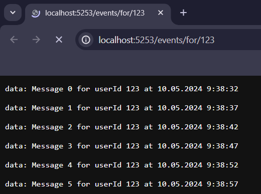

# ServerSideEventsExample
This project demonstrates a minimal implementation of SSE based on asp.net

The server provides an HTTP GET endpoint "/events/for/{userId}" with the header "text/event-stream". 
Once a connection is established to this endpoint, a message is sent every 5 seconds.

